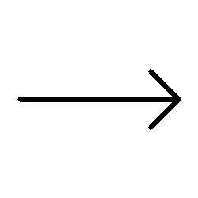
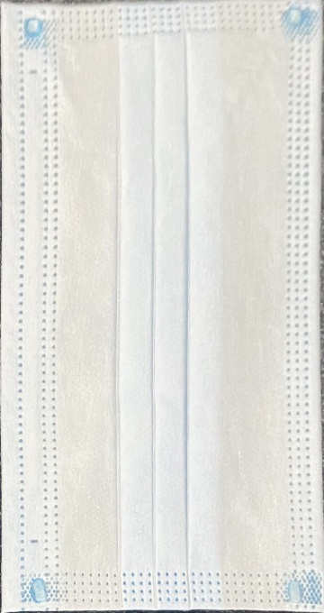

# TaskOfOpencv

主要考察大家对OpenCV基本操作的理解

## 任务描述
> 有一张放在珍珠棉上的口罩的图片，需要大家能够实现下面这样的效果

## 可能用到的知识点
1. CMake
   + 这个就不多说了，可以直接百度
2. OpenCV（**这里只是提供思路，可能有别的方法也能做到同样的效果**）
   + 读写图片（tips: 注意可执行文件和图片相对路径的问题）
   + 二值化
   + 形态学滤波
   + 图像轮廓提取
   + 拟合多边形
   + 凸包检测
   + 透视变换

## 提供的参数
口罩的长宽比大致为 17:9
